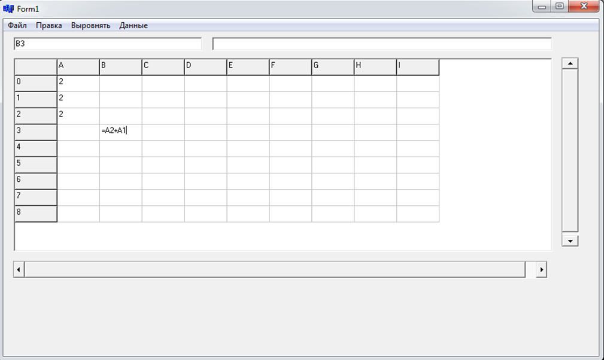
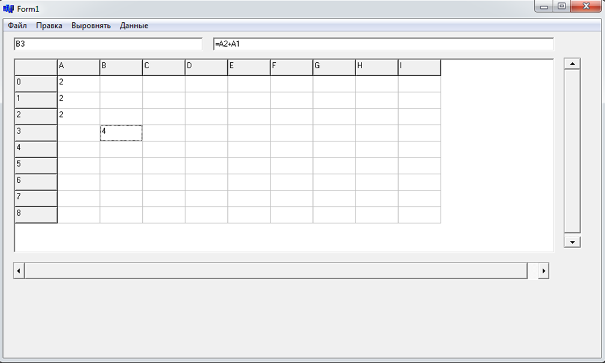
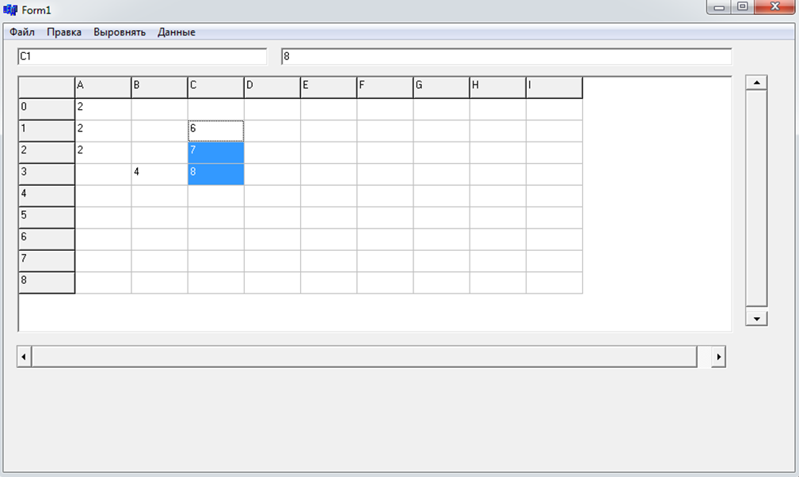
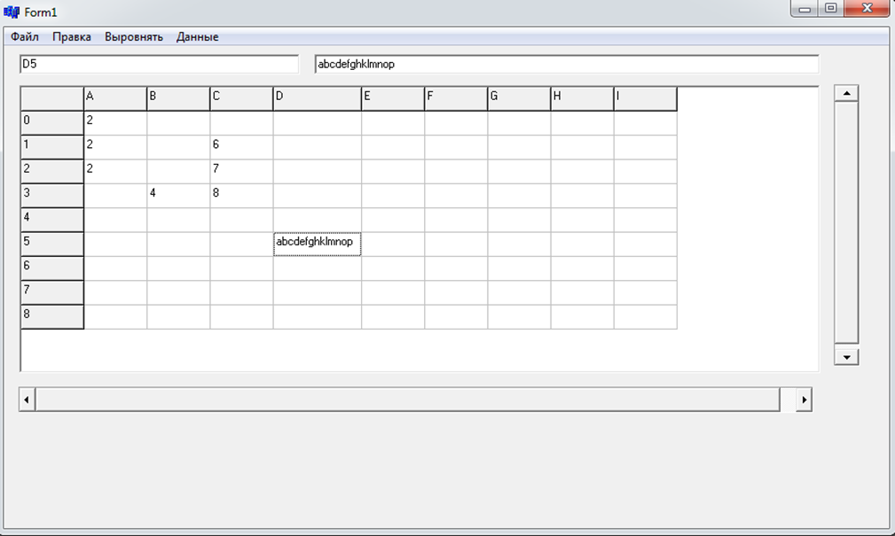
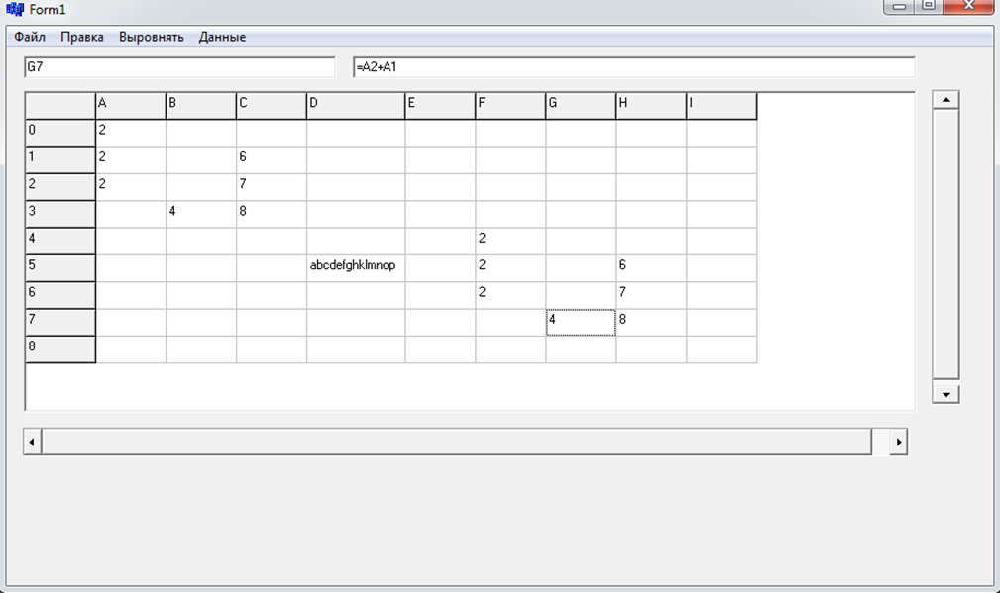

# Проект "Электронные таблицы"
## Задание
В данной курсовой работе требовалось разработать и реализовать концепцию электронной таблицы. Цель проекта – обработка числовых и строковых данных, внесенных в ячейки таблицы. Требовалось разработать и реализовать обработку формул, организовать механизм зависимости формулы от ячеек, входящих в ее состав. Предусмотреть возможность сортировки и поиска информации в таблице. 
	Цели курсового проекта:
1.	Практика работы с компонентом StringGrid.
2.	Изучение основ проектирования проекта.
3.	Изучение основ работы с данными, используя различные алгоритмы.
4.	Практика по созданию «дружественного» и интуитивно понятного пользователю интерфейса.
## Практическая часть
Необходимо было реализовать:
1.	Сохранение таблицы в бинарный файл.
2.	Чтение таблицы из бинарного файла.
3.	Копирование диапазона ячеек.
4.	Вставка диапазона ячеек.
5.	Возможность возврата последних 10 совершенных действий.
6.	Вычисление выражения.
7.	Поиск подстроки в диапазоне ячеек.
8.	Сортировка диапазона ячеек.

# Диаграмма классов.
* Table– Основной класс таблицы. Обеспечивает взаимодействие между ячейками, их правильную обработку, хранение,  удаление, добавление, отвечает за обработку диапазонов ячеек. 
* Cell– Класс, обеспечивающий работу с  ячейкой – хранение данных, ссылки на ячейки, от которых она зависит, запись информации.
* Datahelper – Класс, в котором реализована работа с данными-поиск и сортировка.
* EquSolver – Класс, в котором реализован алгоритм вычисления изображения. 
* FileHelper– Класс, в котором реализованы методы чтения и запись в бинарный файл.
* NumberHelper – Класс для перевода чисел в строку и обратно.
* TStringGrid– Класс для визуализации таблицы.
* TEdit – Класс для вывода вспомогательной информации. 
* TScrollBar –Класс для представления полос прокрутки.
* TSaveDialog – Класс для представления диалогового окна сохранения файла.
* TOpenDialog – Класс для представления диалогового окна открытия файла.
# Интерфейс

# Заключение
Электронные таблицы «Table»  выполняют получение, анализ, хранение данных. Имеется возможность вычисления выражений. Если выражение записано неправильно, в результате возвращается ноль. Хранение таблицы осуществляется в бинарном файле. 

При написании электронной таблицы были изучены основы работы с c++ builder, его компонентами, алгоритмы для работы с данными .

Электронная таблица «Table» может использоваться для хранения и обработки различных данных. Так же данный проект можно использовать в областях, связанным с построением математических зависимостей, работы с большими объёмами данных, например, в банках. Помимо этого, данный проект может использоваться в качестве базы для написания более мощного средства для математического моделирования.

Данные таблицы позволяет быстро и эффективно находить и обрабатывать информацию.
