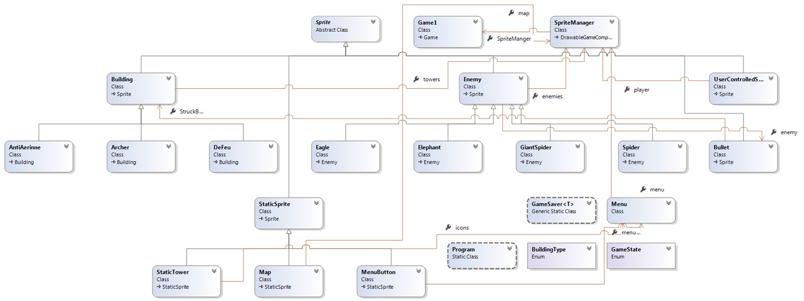
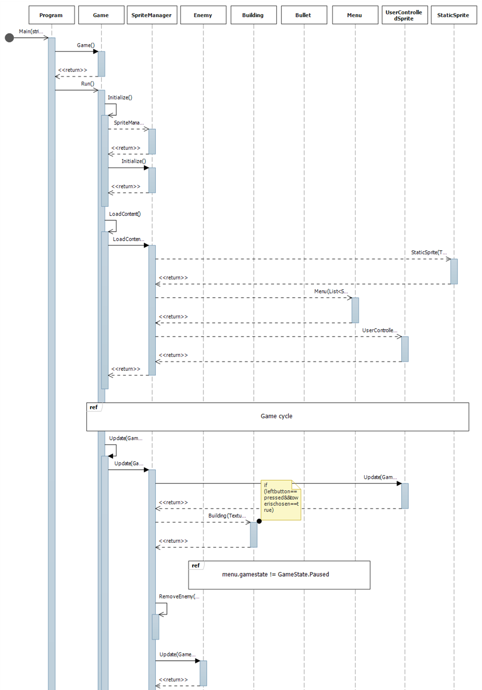
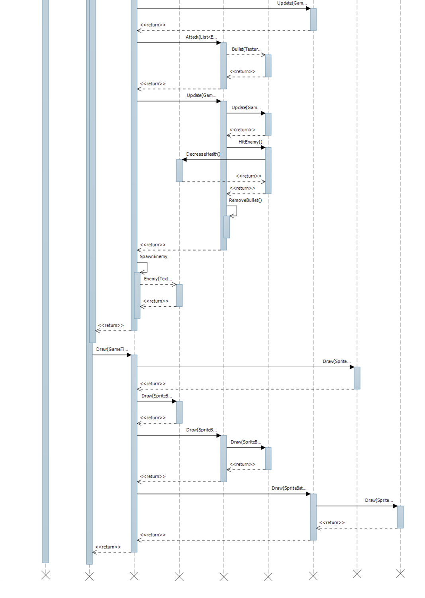
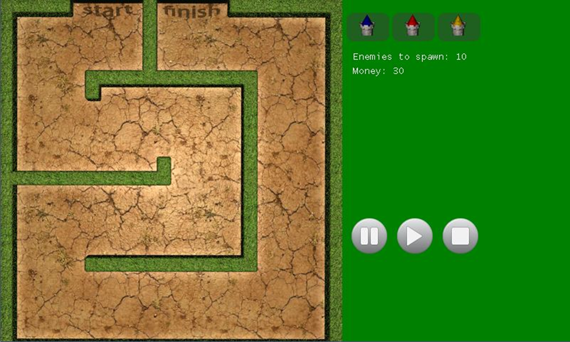
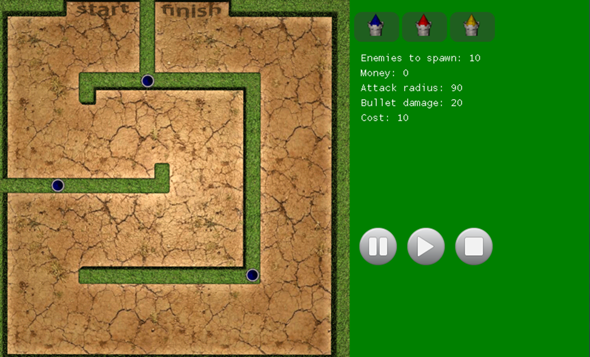
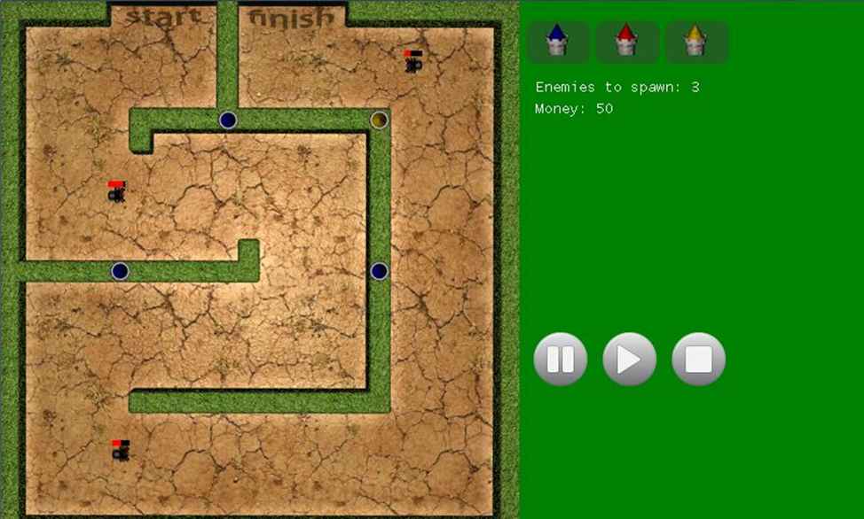

# Отчет по курсовому проекту «Игра Tower Defence»
## Задание
Задача курсового проекта создать игру при этом создать ряд классов, объекты которых будут взаимодействовать между собой. Графический интерфейс игры должен удовлетворять современным требованиям к подобным проектам.
# Практическая часть
Вражеский объект имеет следующие характеристики:
* Здоровье (На текущий момент и максимально возможное)
* Скорость движения
* Траектория движения

В игре представлены следующие типы врагов:
* Eagle
* Elephant
* GiantSpider
* Spider

Здания – объекты, обеспечивающие атаку вражеских объектов.

Здание имеет следующие характеристики:
* Скорость перезарядки
* Радиус атаки
* тип пули (радиус атаки пули, скорость движения пули, урон, наносимы пулей).

В игре представлены следующие типы зданий:
* AntiAerinne
* Archer
* DeFeu
Земля – площадка, на которой располагаются враги и здания.

Существует  3 игровых зоны:
* Вражеская – площадка земли, отведенная под движение вражеских объектов. Вражеские объекты появляются в строго определенном месте, обозначенном словом start.
* Строительная – специальные участки земли, на которые производится строительство новых зданий. 
* Защищаемая – участок земли, до которого должны добраться вражеские объекты. Обозначена словом finish.

# Диаграмма классов

SpriteManager – Основной класс игры. Обеспечивает взаимодействие между объектами, их правильную обработку, подачу команд основной управляющей структуре Game Microsoft XNA. 

Sprite—Класс для представления игрового объекта.

Enemy – Класс, обеспечивающий работу с врагом– логику, физику движения, прорисовку, взаимодействие с другими объектами.

Eagle, Elephant, Spider, GiantSpider—Классы для представления различных видов врагов.

StaticSprite—Класс для представления статического игрового объекта.

Map – Класс обеспечивающий прорисовку и разделение карты.

MenuButton– класс обеспечивающий работу с кнопками меню. 

StaticTower– класс, представляющий здание в меню выбора. 

Building – Класс для представления здания. Обеспечивает его логику поведения, и прорисовку.

Building Type – Перечисление, хранящее в себе типы зданий.

AntiAerinne, Archer, DeFeu – Классы для представления различных видов зданий.

UserControlledSprite – Класс, обеспечивающий работу пользователя с игровыми объектами.

Bullet – Класс для представления снаряда. Обеспечивает его логику поведения, взаимодействие с вражескими объектами и прорисовку.

GameState– Перечисление, хранящее в себе состояния игры.

Menu – класс для представления и работы с меню зданий, состояний игры и информации об игре в реальном времени.

MyGame – наследник стандартного класса Game. Работа игры основана на понятии игрового цикла. Изначально игра создаётся (конструктор), затем происходит инициализация и загрузка контента (метод Initialize и LoadContent соответственно), после чего последовательно вызываются метод Update (обновляет состояния объектов) и Draw (отрисовка объектов). При завершении игры происходит выгрузка контента (UnloadContent).
# Временная диаграмма

# Руководство пользователя
Игра начинается со следующего окна

В начальный момент времени игра находится в состоянии «пауза», для того, чтобы игрок успел расставить башни на игровое поле. Для просмотра информации о башне необходимо навести на нее курсор и  нажать правую кнопку мыши. Чтобы построить здание требуется 1 раз кликнуть на его иконке в меню постройки, затем с помощью мышки указать место постройки. Строить здания можно только в строго отведенной для этого зоне. Для начала игры нужно нажать на соответствующую иконку в меню. Так же в меню находится клавиша «перезапуск», которая начинает игру с начала. Количество денег у игрока и количество врагов, которые появятся, доступны в меню.

Красная полоска над каждым врагом – это показатель здоровья(Health Bar). За уничтожение врага игроку начисляются денежные средства, которые он может вложить в строительство башен. Формируя правильное расположение зданий, вы не позволите проникнуть врагам к вашей базе. В каждой новой волне враги становятся сильнее. Для окончания игры вам надо уничтожить всех юнитов противника.

# Заключение
В результате реализации проекта была достигнута следующая цель - разработана легко модифицируемая игра типа tower defence (меняя фон и изображение объектов можно легко получить как средневековые сценарии защиты, так и современные с участием ПВО, артиллерии, танков и самолетов).

В ходе реализации проекта получены основательные навыки работы с инкапсуляцией данных. И можно сделать вывод, что во многих случаях механизм инкапсуляции существенно помогает упростить задачу программирования сложных систем.
