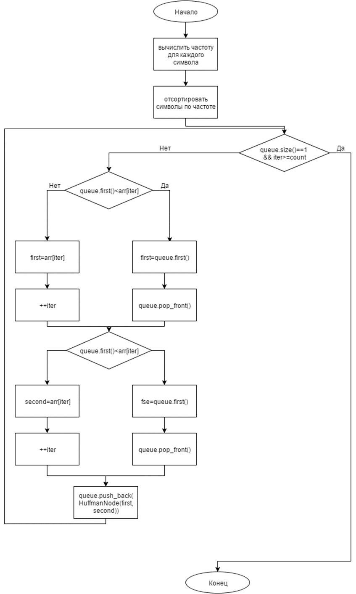
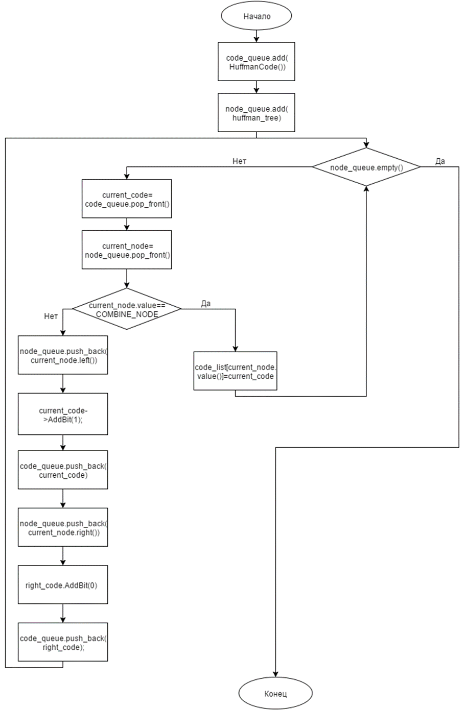
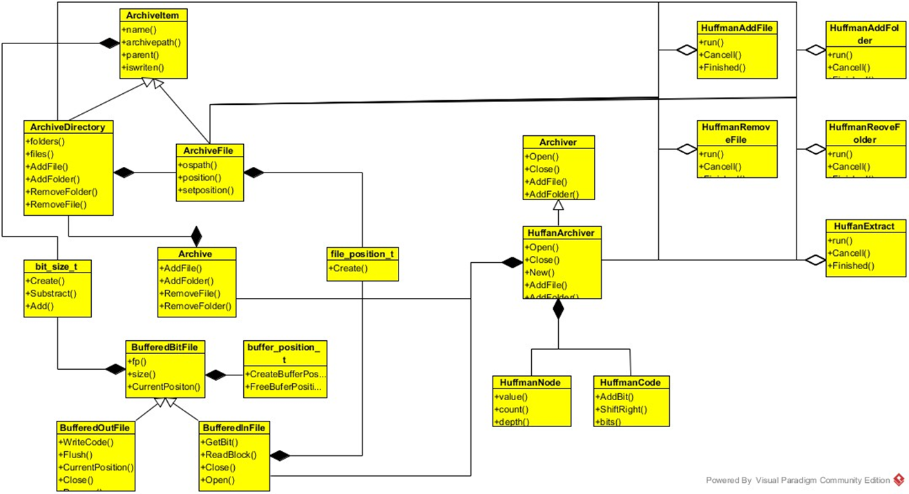
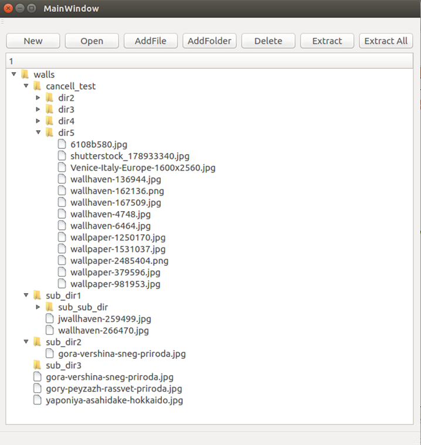
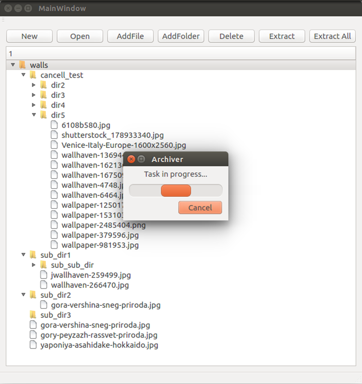
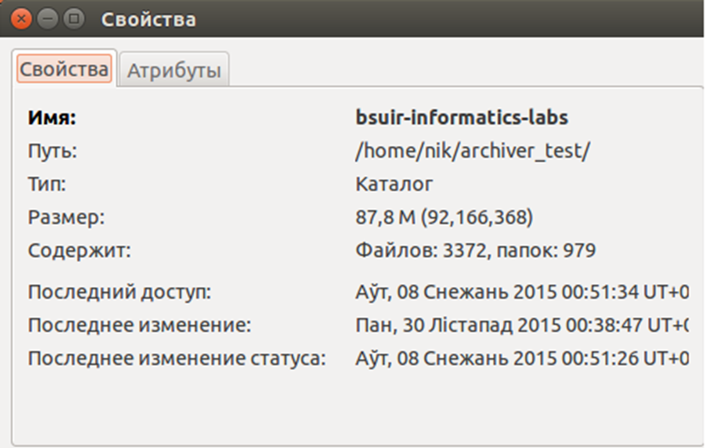
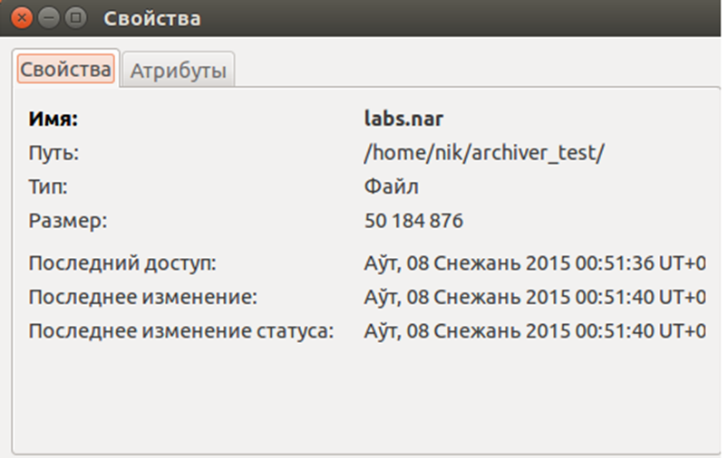

# Курсовой проект "Архивация и сжатие данных"
# Введение
В настоящее время множество информации хранится на носителях, а также передается через Интернет. Поэтому актуальным становится вопрос ускорения процесса ее передачи и обработки. Другой областью применения архиваторов является резервное копирование данных, когда множество файлов хранятся под одним именем.

Целью работы является изучение основ архивации и сжатия данных.

Задачи, поставленные для выполнения данной работы: проектирование и реализация программы-архиватора, позволяющей помещать копии файлов и папок любой вложенности в архив и извлекать из архива, просматривать оглавление архива и тестировать его целостность, удалять файлы и папки, находящиеся в архиве и обновлять их.

Рисунок 1 – построение бинарного дерева

Рисунок 2 – построение кодов Хаффмана
# Проектирование
Прежде всего стоит отметить, что архиватор должен иметь возможность использовать различные алгоритмы сжатия при своей работе. Для этого необходимо иметь базовый класс архиватора с необходимым интерфейсом, которому должен следовать архиватор, реализующий любой другой алгоритм сжатия.

Разрабатываемый продукт будет поддерживать архивацию файлов и папок. Для этого создадим классы, которые будут описывать тип папки и тип файла архива. Общие свойства выделим в базовый класс элемента архива. Все файлы и папки хранятся в архиве, для которого также предусмотрен отдельный тип. Это тип обеспечивает всевозможные операции со своим содержимым: удаление, добавление, получение количества содержащихся файлов.

Как было замечено выше, создадим отдельный класс, который реализует алгоритм Хаффмана и следует интерфейсу архиватора. Для этого алгоритма нам также понадобятся типы, представляющие узел в дереве Хаффмана, а также код для каждого символа.

Исходя из [1], получаем что длина кода для каждого символа может быть различной и не кратной байту. Таким образом необходима разработка эффективного способа записи кода произвольной длины в файл. Для этого разработаем класс, который будет использовать буфер для записи произвольного числа бит. Для декодирования нам понадобится класс, поддерживающий побитовое чтение из файла.

Для того, чтобы пользователь мог взаимодействовать с нашим приложением во время выполнения длительных операций целесообразно реализовать выполнения операций над архивом в отдельном потоке.
# Реализация архиватора на основе выбранного алгоритма
Классы, реализующие архиватор, находятся в папках archiver и Huffman:
* class Archiver – базовый класс архиватора.
* class ArchiveDirectory – класс, который представляет директорию, находящуюся в архиве.
* class ArchiveFile – класс, представляющий находящийся в архиве файл.
* class ArchiveItem – класс, представляющий элемент архива.
* class Archive – класс архива.
В директории Huffman содержаться классы, реализующие алгоритм Хаффмана.
* class HuffmanArchiver – класс, в котором реализованы основные операции с архивом.
* class HuffmanCode – класс кода Хаффмана для символа.
* class HuffmanNode – класс, описывающий дерево Хаффмана.

Иерархию классов можно проследить на рисунке 3.

К основным операциям относятся операции добавления файла и папки, удаление файла и папки, разархивирование файла и папки.

Для того, чтобы получить таблицу с частотами необходимо считать файл, который необходимо заархивировать. Для реализации декодирования нам также понадобится эта таблица, поэтому запишем ее в начало файла (архива). 

По полученной таблице с частотами символов построим дерево, необходимое для кодирования файла. С использованием построенного дерева создадим код для всех встреченных символов в файле. Теперь исходный файл может быть закодирован одним из кодов. Для этого необходимо пройти по исходному файлу и каждый встреченный символ заменить в архиве его кодом.

При открытии файла будем считывать таблицу частот, по ним строить дерево, из которого затем получим коды для символов.

Следующей операций является удаление файла. При удалении файла из архива необходимо удалить все его коды из архива, а также уменьшить частоту символов в таблице частот символов. Так как в архиве находятся коды символов, а не сами символы, то необходимо сначала раскодировать все символы, после чего уменьшить их частоты. После обновления таблицы символов построим заново дерево и создадим для каждого символа код.

Для разархивирования файла достаточно считывать по биту из архива и, исходя из значения бита, двигаться по дереву влево или вправо, пока не будет достигнут лист. Каждый раскодированный символ запишем в отдельный файл. После конечного числа шагов получим раскодированный файл.

Для построения дерева сначала отсортируем таблицу с частотами символов. Теперь будем брать два элемента с минимальными частотами. Из этих элементов получим составной элемент, частота которого будет равна сумме частот двух его потомков. Элементы с минимальными частотами выбираются также и из составных элементов. Очевидно, что для любого числа элементов мы сможем построить такое дерево.

Для генерации кодов символов совершим симметричный обход дерева, постепенно добавляя бит 0 при движении к левому потомку или бит 1 при движении к правому потомку. Дойдя до листа присвоим его символу соответствующий код.

Разработанный архиватор имеет возможность отменить текущее действие с архивом, при этом архив вернется в прежнее состояние, а изменения отменены.

# Реализация поддержки множества файлов и папок

Для создания полноценного архиватора необходима поддержка архивации множества файлов и папок.

Структура архива будет представлять собой дерево, где внутренними узлами дерева являются папки, а листьями – файлы. 

Для хранения множества файлов необходимо изменить структуру архива. Для того, чтобы разархивировать файл требуется знать его размер и положение в архиве. Так как в архиве файла лежат друг за другом и, как правило, имеют размер не кратный одному байту, будем хранить их размер и позицию в структуре, представляющую размер в битах. В архиве будем хранить только размеры файлов, с их помощью при чтении архива легко восстанавливаются позиции всех файлов. Массив с размерами находится в файле после таблицы частот.

С поддержкой множества файлов встает вопрос хранения структуру файлов и папок. Будем хранить последовательность папок и файлов в таком порядке: сначала идет имя папки, затем имена папок и файлов, которые в ней содержаться. Если подпапка также содержит папки или файлы, повторим для нее аналогичную процедуру. После всего содержимого папки запишем специальный символ-разделитель. Запись такого рода позволяет записывать структуры папок любой вложенности, а затем их восстанавливать. Для большего сжатия архива будем также кодировать имена всех файлов и папок.

При добавлении нового файла частоты символов изменятся. Поэтому необходимо обновить таблицу частот. После обновления частот построим новое дерево и новые коды. Для того, чтобы файлы в архиве можно было разархивировать по новой таблице частот, перекодируем все имеющиеся файлы.

Удаление файла выполняется аналогично добавлению. Сначала обновляется массив частот, перестраивается дерево и создаются новые коды. Использую их мы можем перекодировать все файлы кроме удаляемого и записать в новый архив.

При разархивировании файла прочитаем фрагмент архива, соответствующий нужному файлу и, использую дерево, раскодируем в исходный. 
#  Реализация записи кодов в файл
Для записи и чтения блоков информации любой длины служат классы BufferedBitFile, BufferedInFile, BufferedOutFile.
* class BufferedBitFile – класс, представляющий буферизированный файл.
* class BufferedInFile – класс для чтения бит из файла.
* class BufferedOutFile – класс для записи бит в файл.

Данные классы показаны на рисунке 3.

Коды, получаемые при кодировании алгоритмом Хаффмана, как правило, имеют длину, не кратную байту. Исходя из этого необходимо решить проблему записи таких кодов в результирующий файл.

Для повышения производительно заведём буфер (массив символов), в который будем записывать коды последовательно, пока не достигнем максимального размера буфера. Каждый следующий код будем дописывать сразу же за предыдущим. После заполнение буфера запишем его в файл архива.

Другой проблемой является чтение бит из файла. Для хранения бит будем также использовать буфер. В буфер считывается необходимый файл из архива, а затем при вызове функции GetBit() получается следующий бит прочитанного фрагмента архива.
#  Поддержка многопоточности
Для того, чтобы пользователь мог эффективно взаимодействовать через графический интерфейс с архиватором, необходимо обеспечить его выполнение в отдельном потоке. Для этих целей служат классы из директории concurrenthuffman:
* class HuffmanAddFile – класс добавления файла в архив
* class HuffmanAddFolder – класс добавления файла в архив
* class HuffmanRemoveFile – класс удаления файла из архива
* class HuffmanRemoveFolder – класс удаления файла из архива
* class HuffmanExtract – класс для извлечения из архва.

Данные классы приведены на рисунке 3.

Для синхронизации были использованы атомарные переменные.

Рисунок 3 – диаграмма классов
# Руководство пользователя
Главное окно программы представлено на рисунке 4. Сверху расположены кнопки, которые обеспечивают основную функциональность архиватора. Для того, чтобы создать новый архив необходимо нажать кнопку new, где затем ввести имя для нового архива. В случае совпадения имен пользователю будет выдано предупреждения. Для открытия существующего архива пользователь нажимает кнопку open, где выбирает соответствующий архив. Кнопка addfile служит для добавления файла в открытый архив. Чтобы добавить файл в определенную папку, следует ее выделить, после чего нажать на кнопку addfile, где в открывшимся окне выбрать файл. Кнопка addfolder добавляет существующую папку в архив. При добавлении в папку последовательность действий аналогична таковой для кнопки addfile. Кнопка delete служит для удаления элемента архива. Для этого следует выделить необходимый элемент и нажать кнопку. Кнопка extract выполняет разархивацию выделенного элемента. Кнопка extractall выполняет разархивацию всех файлов. 

По центу главного окна расположено дерево с файлами и папками открытого архива. Файлы и папки имеют соответствующие иконки. Если в папке находятся другие элементы, то рядом с ней находится треугольник, нажав на который будет показано содержимое выбранной папке. 

При выполнении длительный операции пользователь видит диалоговое окно, показанное на рисунке 5. Нажав на кнопку cancel он прервёт текущую операцию над архивом.

Рисунок 4 – Основное окно программы

Рисунок 5 – Выполнение длительной операции

Рисунок 6 – Размер исходной папки

Рисунок 7 – Размер полученного архива
# Заключение
В ходе выполнения работы был спроектирован и реализован программный продукт, способный выполнить все основные функции, возлагаемые на архиватор. Он способен работать с файлами любых форматов и папками произвольно вложенности, обеспечивая степень сжатия до 8 раз. На рисунках 6 и 7 показано сжатие папки, состоящей из 979 папок и 3372 файлов общим размером 87,8 мб, которое было выполнено за 6,64 секунды, что является очень хорошим результатом.
