#Лабораторные работы по теории траснляции "Лексический, синтаксический, семантический анализаторы. Кодогенератор. Интерпретатор"
# ЛР 1. Обратная матрица
Разработать собственный лексический анализатор подмножества языка программирования Pascal, для чего определить лексические правила и выполнить перевод потока символов в поток лексем (токенов).
На вход программы подается текстовый файл (с именем INPUT.TXT), содержащий единственную строку символов. Данная строка задает присваивание переменной значения арифметического выражения в виде 
ПЕРЕМЕННАЯ = ВЫРАЖЕНИЕ. Выражение может включать: 
- Знаки сложения и умножения («+» и «*»); 
- Круглые скобки («(» и «)»); 
- Константы (например, 5; 3.8; 1e+18, 8.41E–10);
- Имена переменных. 
Имя переменной – это последовательность букв и цифр, начинающаяся с буквы. Входное выражение считать правильным. 
## ЛР 2. Синтаксический анализатор
Проверка исходного текста программы на соответствие синтаксическим нормам языка с построением дерево разбора (синтаксическое дерево), которое отражает синтаксическую структуру входной последовательности и удобно для дальнейшего использования, в случае несоответствия - вывод сообщения об ошибке. На основе анализа выражений, состоящих из литералов, операторов и круглых скобок выполнить группирование токенов исходной программы в грамматические фразы, используемые компилятором для синтеза вывода. Представление грамматических фраз исходной программы выполнить в виде дерева. Реализовать синтаксический анализатор с использованием одного из табличных методов (LL-, LR-метод, метод предшествования и пр.).
## ЛР 3. Семантический анализатор
Разработать собственный лексический анализатор подмножества языка программирования Pascal для контроля совместимости типов в соответствии с утвержденной грамматикой. Программа должна выдавать сообщения о наличие во входном тексте ошибок, которые могут быть обнаружены на этапе семантического анализа
На вход программы подается текстовый файл (с именем INPUT.TXT), содержащий единственную строку символов.
## ЛР 4. Кодогенертор. Интерпретатор
Требуется написать программу, которая на основании дерева синтаксического разбора порождает объектный код и затем выполняет его. В качестве исходного дерева синтаксического разбора рекомендуется взять дерево, которое порождает программа, построенная по заданию предыдущих лабораторных работ.
На вход программы подается текстовый файл (с именем INPUT.TXT), содержащий единственную строку символов.
# Практические результаты и выводы
В результате выполнения лабораторных работ по курсу «Теория трансляции» был разработан компилятор для ограниченного множества операторов языка Pascal. 

Были написаны 4 основные компоненты компилятора: лексический анализатор, синтаксический анализатор, семантический анализатор, простейший компилятор. Каждая из компонент последовательно преобразует представление программы используя представление, полученное на предыдущем этапе.

На вход компилятора поступает исходный код на языке Pascal. Исходный код программы передается лексическому анализатору, который разбивает его на токены (результат разбивания на токены можно увидеть на рисунке 1), используя при этом конечный автомат, реализованный с использованием конструкций if/else, при этом производя проверку символов на принадлежность алфавиту (пример проверки символа, не принадлежащего алфавиту, представлен на рисунке 2). Каждая лексема заносится в один из классов лексем. Реализация семантического анализатора приведена в приложении 1. Последовательность токенов передается синтаксическому анализатору, проверяющему принадлежит ли эта последовательность формальной грамматике языка (примеры проверок синтаксиса приведены на рисунках 4, 5, 6). Синтаксический анализатор был реализован на основе метода рекурсивного спуска, построенного на основе грамматики языка Pascal, описанной с помощью расширенной формы Бэкуса-Наура. Затем последовательность лексем преобразуется в дерево разбора (синтаксическое дерево, которое представлено на рисунке 3). Реализация синтаксического анализатора приведена в приложении 2. Следующем этапом компиляций является семантический анализ. На данном этапе проверяются контекстные условия (единственность объявления переменных (рисунок 8), соответствие типов (рисунок 9), присвоение значения константам в программе (рисунок 7) и др.). Реализация семантического анализатора приведена в приложении 3. Корректная программа передается простейшему компилятору, который транслирует ее в трехадресный код (пример трехадресного кода приведен на рисунке 10), который служит промежуточным представлением программы. Для выполнения трехадресного кода служит регистровая виртуальная машина. После выполнения на виртуальной машине выводятся результаты (результаты выполнения исходной программы представлены на рисунке 11). Если во время компиляции найдена ошибка, то компиляция прерывается и выводится соответствующая ошибка с пояснением. Реализация кодогенератора и виртуальной машины приведена в проложении 4.
# Примеры работы компилятора
## Лексический анализатор
Входная строка:
```
program lab1;
var cost, price, tax: real;
begin
cost:=(price+tax)*0.98;
if(cost<10)then
  cost:=10;
else
  cost:=100;
end.
```
Результат работы лексического анализатора:

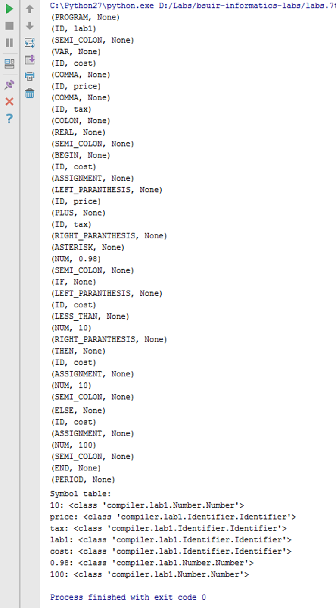

Рисунок 1 – Разбивание на список токенов

Добавим в текст программы символ, не входящий в алфавит языка:
```
cost:=(pr#ice+tax)*0.98;
```
Получим сообщение об ошибке:

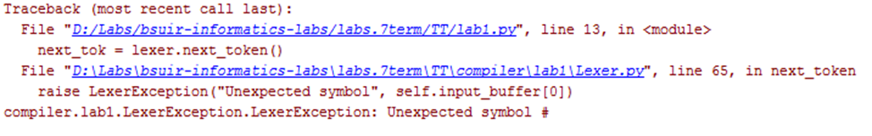

Рисунок 2 – распознавание символа, не принадлежащего алфавиту.

## Синтаксический анализатор
Входная строка:
```program lab1;
const tempcont=10;
tempcost1=20;
var
cost, price, tax: real;
begin
cost:=(price+tax)*0.98;
if(cost<10)then begin
  cost:=10;
end
else
  cost:=100;
end.
```
Результат работы синтаксического анализатора:

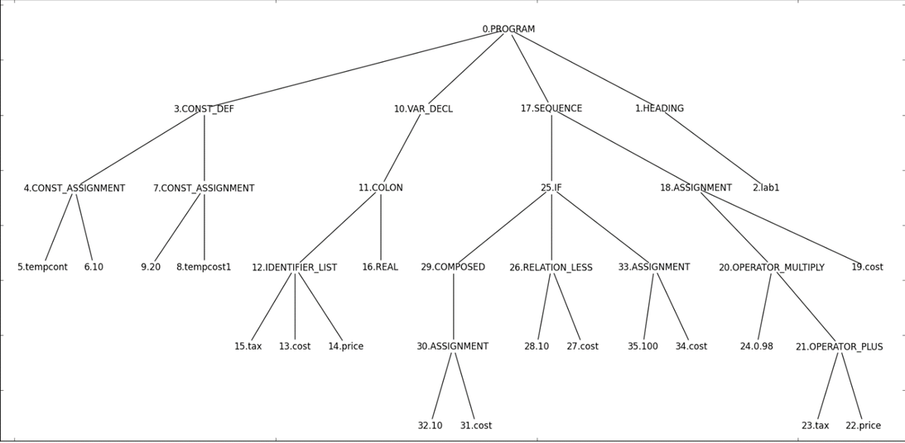

Изменим строку исходной программы на:
`if(cost<10)while begin`
Получим сообщение об ошибке:

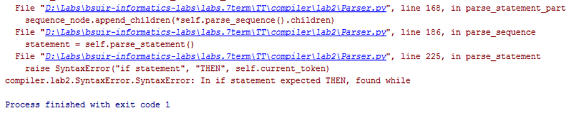

Рисунок 4 – синтаксическая ошибка в конструкции if

Изменим строку исходной программы на:
`cost:<(price+tax)*0.98;`
Получим сообщение об ошибке:

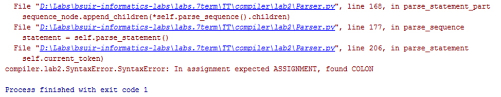

Рисунок 5 – неверное присвоение

Изменим строку исходной программы на:
`program lab1)`
Получим сообщение об ошибке:

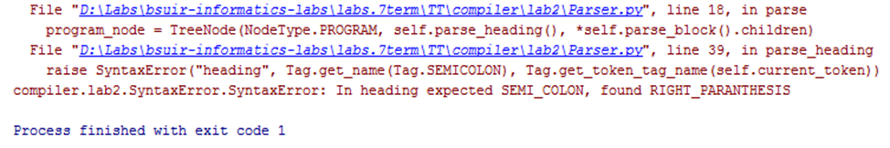

Рисунок 6 – неверное название программы

## Семантический анализатор
Входная строка:
```
program lab1;
const tempcont=10;
tempcost1=20;
var cost, price, tax: real;
begin
tempcont:=(price+tax)*0.98;
if(cost<10)then 
  cost:=10
else
  cost:=100;
end.
```
Результат работы семантического анализатора:

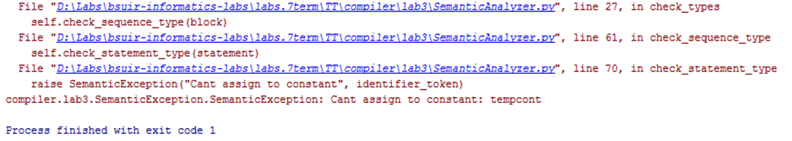

Рисунок 7 – присвоение значения константе

Добавим в исходную программу двойное объявление переменной:
`var tempcont, price, tax: real;`

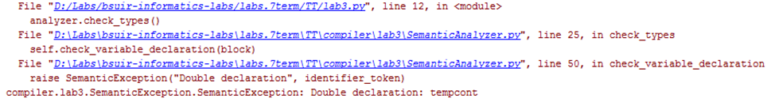

Рисунок 8 – двойное объявление переменой

Добавим в исходную программу несоответствие типов:
`if(cost<True)then `

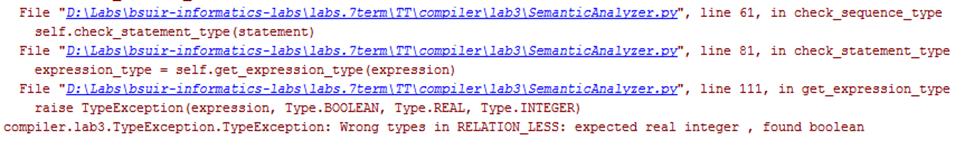

Рисунок 9 – несоответствие типов

## Кодогенератор. Интерпретатор:
Входная строка:
```
program lab1;
var cost, price, tax: real;
begin
cost:=(price+tax)*0.98;
if(cost<10)then
  cost:=10;
else
  cost:=100;
end.
```
Результат работы кодогенератора:

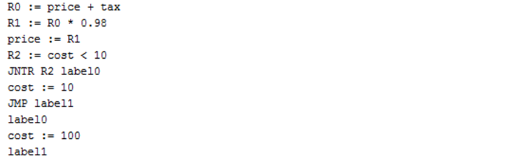

Рисунок 10 – трехадресный код

Результат исполнения полученного кода интерпретатором:

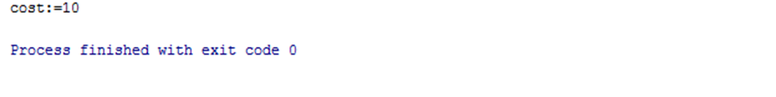

Рисунок 11 – результат выполнения программы


