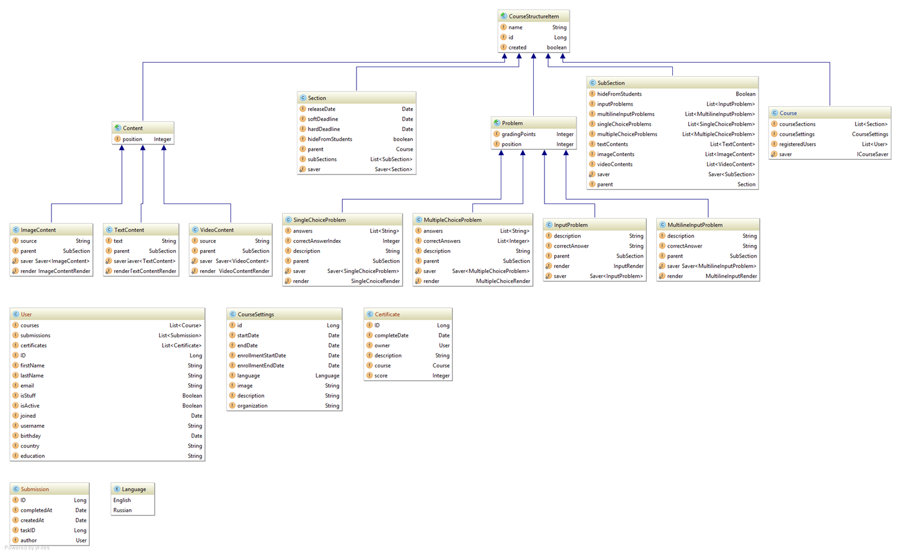
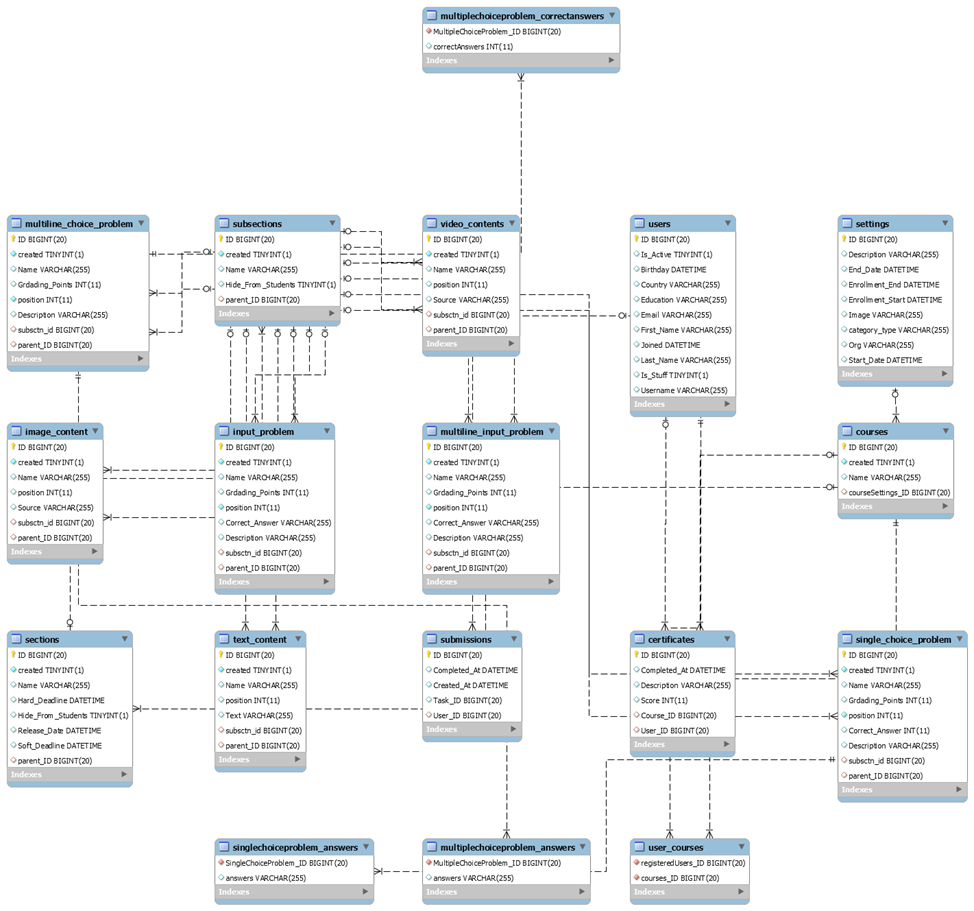
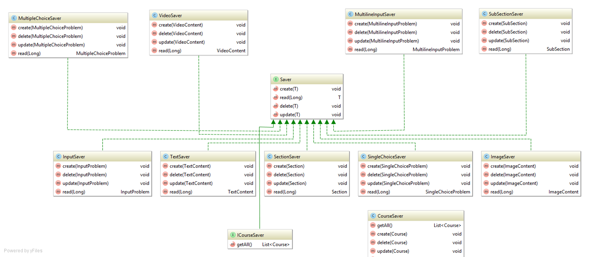
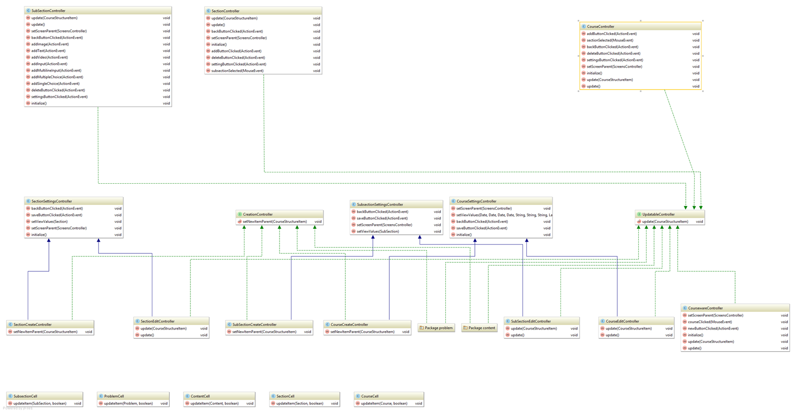
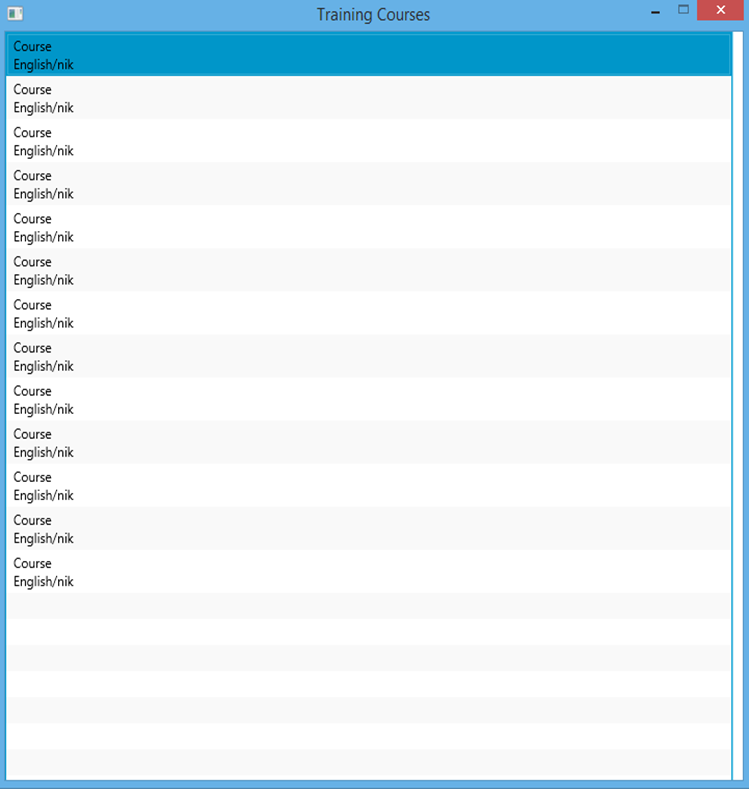
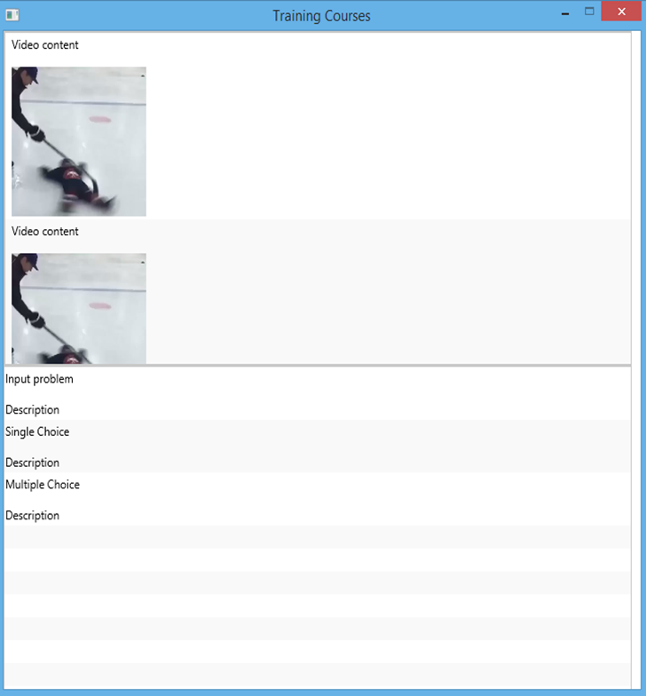

# Курсовой проект по дисциплине "Модели данных и системы управления базами данных" "База данных учебных курсов"
## Введение
Курсовой проект «База данных учебных курсов» имеет ряд особенностей, которые необходимо учитывать при проектировании базы данных:
* Каждый курс имеет уникальную структуру;
* Каждый курс должен быть разделен на недели, которые в свою очередь должны быть разделены на уроки;
* Каждый курс должен быть легко изменяем.
* Курсы могут сильно различаться по своему размеру.

## Задачи проектирования
Чтобы приступить к непосредственному проектированию базы данных, необходимо выделить минимальный набор основных сущностей и указать типы связи между ними.

В рассматриваемой предметной области можно выделить следующие основные сущности:
* Certificate – сертификат, выдаваемый пользователю при удачном окончании курса.
* Course – сущность, которая представляет корень древовидной структуры курса.
* CourseSettings – настройки курса, такие как язык, организация, настройки, даты начала и окончания, начало и окончание регистрации на курс.
* ImageContent – графические материалы, добавляемые в урок.
* InputProblem – задание с вводом краткого ответа, добавляемое в урок.
* Language – язык курса.
* MultilineInputProblem – задание с вводом развернутого ответа, добавляемое в урок.
* MultipleChoiceProblem – задание с возможностью выбрать несколько правильных ответов, добавляемое урок.
* Section – сущность представляющая собой учебную неделю, из которых состоит курс.
* SingleChoiceProblem – задание с возможностью выбрать один правильный ответ, добавляемое в урок.
* Submission – сущность, представляющая собой попытку пользователя сдать задание урока.
* SubSection – сущность, представляющая собой урок, из которых состоит учебная неделя.
* TextContent – текстовые материалы, добавляемые в урок.
* User – сущность, представляющая собой пользователя, который участвует в учебных программах.
* VideoContent – видеоматериалы, добавляемые в урок.
Диаграмма классов представлена на рисунке 1.

Рис 1. Диаграмма классов сущностей

## Требования к разрабатываемому программному обеспечению
Готовый программный продукт должен удовлетворять следующим требованиям:
1.	Иметь простой и понятный интерфейс;
2.	Доступ к базе данных через приложение должен осуществляться посредством технологии объектно-реляционного отражения (ORM), в качестве которой выступает Hibernate;
3.	СУБД: MySQL  Server;
4.	Возможность создавать новые и изменять уже существующие курсы;
5.	Возможность изменять существующие учебные недели (создавать новые, удалять существующие, изменять настройки);
6.	Возможность изменять существующие уроки (создавать новые, удалять существующие, изменять их настройки);
7.	Возможность создавать различное количество материалов любого из 3 типов.
8.	Возможность создавать различное количество материалов любого из 4 типов.
9.	Возможность редактировать курсы несколькими пользователями одновременно.
10.	Поддержка сертификатов для пользователей, удачно закончивших курс.
11.	Сохранение для пользователя предыдущих выполнений заданий
## Проектирование схемы базы данных
Сущности, используемые в программном продукте связаны следующими типами отношений (можно увидеть на рис. 1):
- 1:1:
  - Course - CourseSettings
- 1:n:
  - User – Certificate 
  - Course – Certificate
  - Course – Section 
  - Section - SubSection 
  - Subsection – ImageContent
  - Subsection - TextContent
  - Subsection - VideoContent
  - Subsection - InputProblem
  - Subsection - MultilineInputProblem
  - Subsection - SingleChoiceProblem
  - Subsection – MultipleChoiceProblem
  - User - Submission
- m:n:
  - Course – User
Для представления стандартных типов языка Java были использованы следующие типы языка SQL:
- Long – BIGINT
- Boolean – TINYINT
- String –VARCHAR
- Integer – INT
- Date – DATETIME
Диаграмма таблиц базы данных представлена на рисунке 2.
  

Рис. 2. Диаграмма таблиц базы данных.
## Реализация доступа к базе данных
Для доступа к базе данных используются ORM Hibernate и Java Persistence API. Что позволяет организовать схему базы данных и все запросы к ней использую аннотации JPA. 

Подробнее связи между классами показаны на рисунке 4.

Рис. 3. Диаграмма классов сохранения в базу данных
## Реализация клиентской части
Реализация окон приложения была выполнена с использованием языка fxml.  Перечислим основные разметки, использованные в проекте. Course_settings-grid pane, course view-anchor pane, courseware-anchor pane, section_settings-grid pane, section_view-anchor pane, subsection_settings-grid pane, subsection_view-anchor pane, image_ivew-anchor pane, text_view-anchor pane, video_view-anchor pane, choice_problem-anchor pane, input_problem-anchor pane, multiline_input_problem-anchor pane.

Привязка событий и элементов с формы приложения к коду выполнено через разметку fxml, а также специальные аннотации fxml.  

Перечислим основные экраны приложения:
- главный экран
- экран курса
- экран настройки курса
- экран учебной недели
- экран настроек учебной недели
- экран учебного урока
- экран настроек учебного урока
- экран проблемы выбора с единственным правильным ответом 
- экран проблемы выбора с множественными правильными ответами 
- экран проблемы ввода краткого ответа
- экран проблемы ввода краткого ответа
- экран проблемы ввода подробного ответа
- экран текстового материал
- экран графического материала
- экран видеоматериала
Каждый из перечисленных экранов имеет два вида контроллера: контроллер создания нового объекта и изменение уже существующего. Все поля, в которое возможен пользовательский ввод, затем сохраняют свои значения в соответствующем объекте, для чего используются вызовы функций, определенных в стандартных типах javafx.

Каждый контроллер имеет специальных функции, которые заполняют форму значениями из прочитанного из базы объекта, а также изменяют поля объекта в соответствии с введенными пользователем данными.

Для отображения содержимого курсов, недель и уроков служат контейнеры ListView. В программном продукте было необходимо переопределить стандартный формат отображения элементов ListView. Для этого javafx предоставляет метод setCellFactory. Для отображения каждого из вышеупоменутых элементов курса был созданн отдельный класс, представляющий собой ячейку ListView.

Уроки могут содержать графические данных двух видов: изображение и видео. После некоторых раздумий для отображения изображений был выбран компонент ImageView, а для видео-MediaView. С помощью компонента MediaView возможно реализовать все стандартные операции, доступные в большинстве видеоплееров: играть, остановить, продолжить.

Среди заданий урока также могут содержаться выбор с единственным правильным ответ и со множеством правильных ответов. Для этого были использованы RadioButton и CheckBox соответственно.

Все классы контроллеров приведены на рисунке 4.

Элементы пользовательского интерфейса приведены на рисунках 5 и 6.
## Реализация бизнес-логики
Каждый объект, который может быть сохранен в базу данных имеет свойство saved, которое используется в едином методе save для таких объектов чтобы разграничить сохранение новых объектов и создание уже существующих. 

Каждый объект снабжен геттером и сеттером для каждого поля, что также является требованием Java Persistence API.

Каждый реализованный в проекте пользовательский тип имеет статическое поле, которое представляет собой объект, ответственный за сохранение данного типа в базу данных. Ответственный за сохранение объект реализует интерфейс, что позволяет легко изменять механизм сохранение пользовательского типа в базу данных. Все объекты, ответственные за сохранение связываются с соответствующими классами в методе Main в начале запуска приложения.

Для трех типов содержимое и четырех типов заданий существуют свой тип отрисовщика. Каждый отрисовщик является статическим объектом и задается в методе Main, что позволяет хранить только один эксземпляр для всех объектов содержимого и заданий.

Рис 4. Диаграмма классов контроллеров.

Рис 5. Главное окно программы.

Рис 6. Окно учебного урока.
## Тестирование
Добавление 1000 заданий: 33,20 секунды.

Добавление 1500 материалов: 42,96 секунды.

Добавление 50 уроков со 105 материалами: 200,30 секунд.

Добавление 5 недель по 10 уроков, состоящих из 105 материалов каждый: 176,70 секунд.

Добавление 5 курсов по 5 недель, состоящих из 10 уроков по 60 материалов каждый: 710,93 секунд.
## Описание применения
Данный программный продукт может быть внедрен в учреждения образования различного уровня. И, в первую очередь, использоваться как дополнение к основному материалу для самостоятельной работы дома. Для работы данной в системе требуется лишь запустить сервер, на котором будет работать сервер базы данных. Для пользования программным продуктом требуется наличие интернета и компьютера.

Для студентов, которые не имеют возможности учится очно данный продукт позволит получить образование более высокого качества.

Учебные курсы можно сделать таким образом, чтобы получать их любой сложности и длины.  Инструкторы могут как создавать новые курсы, так и редактировать уже существующие.
## Заключение
Таким образом был создан программный продукт, отвечающий всем поставленным требованиям. Он может быть использован учениками различных учебных заведений. В программе используется простой, интуитивно понятный интерфейс. 

Наряду с этим проект «учебные курсы» является достаточно гибком, для создания курсов любого формата и может быть применен в заведениях разного уровня. Если посмотреть на тесты из раздела 4, то становится очевидно, что «умные курсы» могут выдерживать даже высокие нагрузки, отвечая пользователям за приемлемое время.
